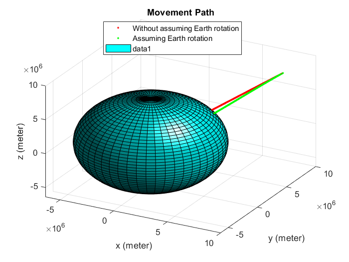
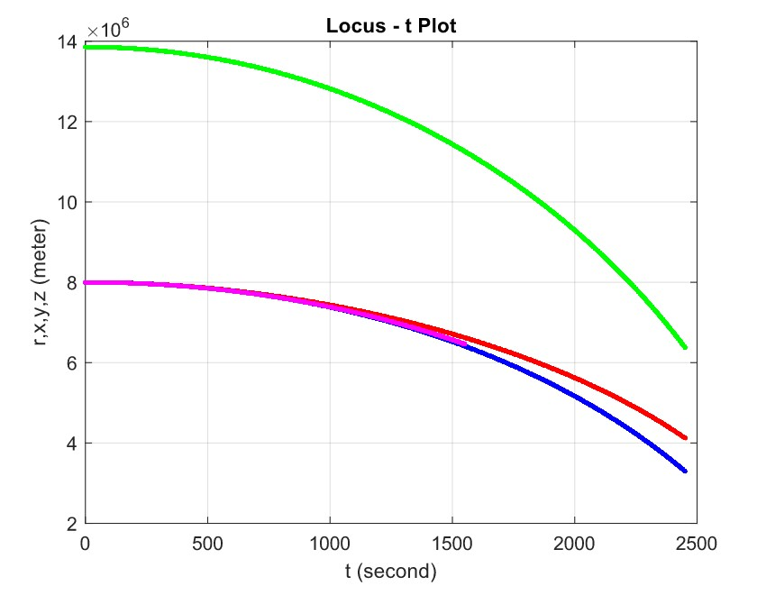
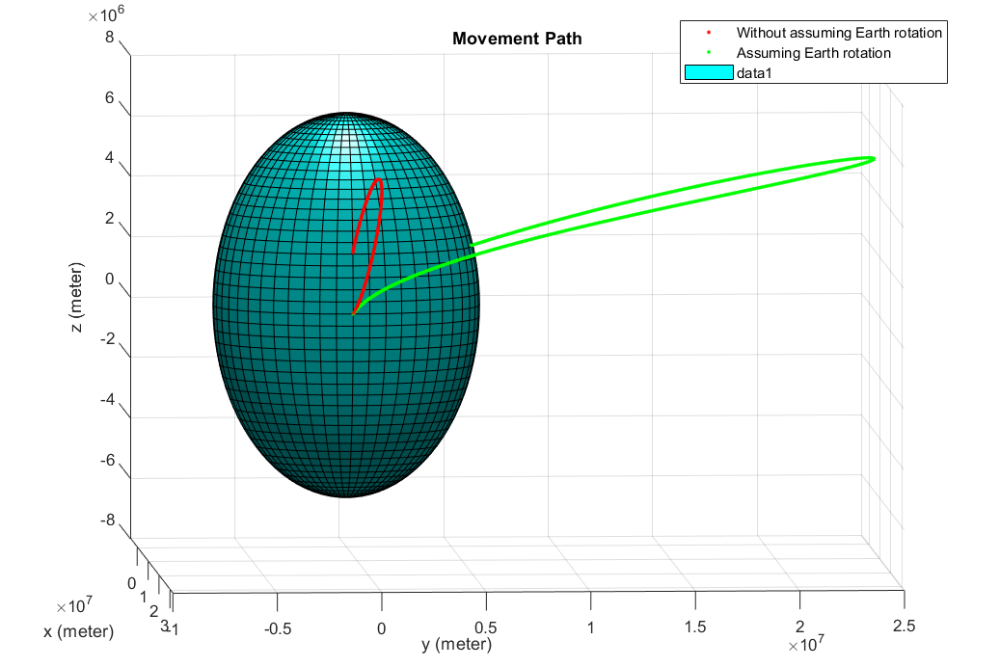
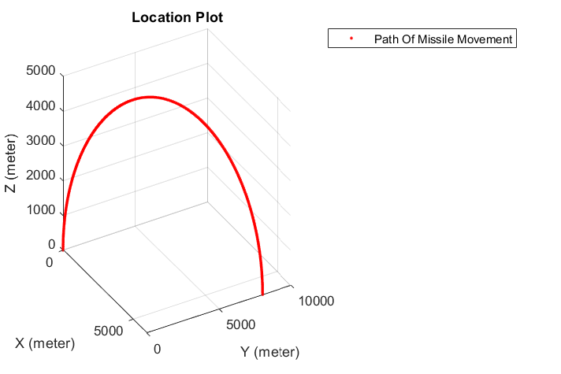
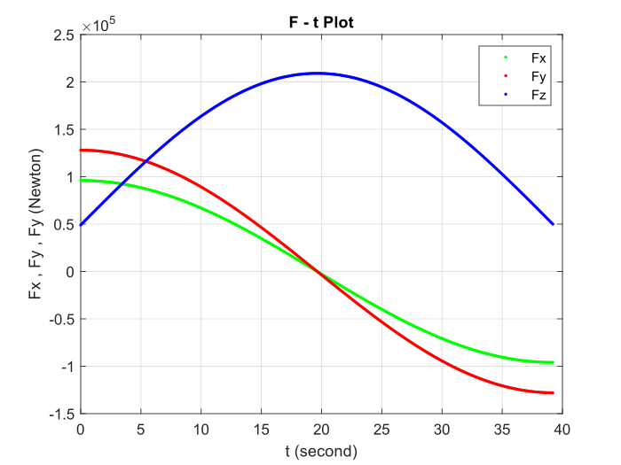

# Dynamics_Projects

## Satelite

Both fixed and moving frame has been assumed in the center of Earth. Also, the Runge Kutta algorithm has been written manually and ode45 has not been used.

  
  

   

## Projectile

Both fixed and moving frame has been assumed in the center of Earth. Also, the Runge Kutta algorithm has been written manually and ode45 has not been used.

  
  

   

## Missile

A missile has been launched in X = Xi , Y = Yi , Z = 0 and the velocity of missile during the Movement is constant. The problem is finding Fx , Fy , Fz with respect of " t ". All the calculations are without assuming the Earth rotation.

  
  

